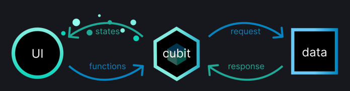

# bloc_example

A new Flutter project.

https://bloclibrary.dev/ko/flutter-bloc-concepts/

## Bloc Key Concepts

### Streams
- 연속적인 비동기 데이터 ex. 물(비동기 데이터)이 흐르는 파이프(Stream)
- async* : 비동기 생성기를 이용해서 작성
```dart
Stream<int> countStream(int max) async* {
  for (int i = 0; i < max; i++) {
    yield i;
  }
}
```

### Cubit

- 외부로 노출 가능
- 초기 상태 정의 필요하지만, 다음처럼 외부의 값을 허용하기도 함
- emitdm protected 메소드이기 때문에 Cubit 내에서만 사용
- 
```dart
class CounterCubit extends Cubit<int> {
  CounterCubit(int initialState) : super(initialState);
  
  void increment() => emit(state + 1);
  
  // Cubit의 내부 state가 업데이트되기 직전에 발생
  @override
  void onChange(Change<int> change) {
    super.onChange(change);
    print(change);
  }
  
  @override
  void onError(Object error, StackTrace stackTrace) {
    super.onError(error, stackTrace);
    print('$error, $stackTrace');
  }
}
final cubitA = CounterCubit(0);
final cubitB = CounterCubit(10);
cubitA.close()
cubitB.close()
```

### BlocObserver
- change를 상속받고, cubit 인스턴스에 접근할 수 있음
- 
```dart
class SimpleBlocObserver extends BlocObserver {
  @overrid
  void onChange(BlocBase bloc, Change change) {
    super.onChange(bloc, change);
    print('${bloc.runtimeType} $change');
  }
}

void main() {
  Bloc.observer = SimpleBlocObserver();
  CounterCubit()
    ..increment()
    ..close();
}
```

### Bloc
- 함수가 아닌 event에 의존하여 state변경을 촉발
- Cubit은 함수를 호출하여 새로운 state를 emit하는 것과 달리, Bloc은 event를 수신하고 수신된 event를 나가는 state로 변환
- Cubit 생성 과정과 비슷한데, + bloc이 처리할 event로 정의해야함
- on<Event> 핸들러를 통해 이벤트 처리

```dart
sealed class CounterEvent {}

final class CounterIncrementPressed extends CounterEvent {}

class CounterBloc extends Bloc<CounterEvent, int> {
  CounterBloc(): super(0) {
    on<CounterIncrementPressed>((event, emit) {
      emit(state + 1);
    });
  }
  
  // 변화 관찰
  @override onChange(Change<int> change) {
    super.onChange(change);
    print(change);
  }
  
  // event 기반이기 때문에 state 변화를 촉발한 원인에 대한 정보도 캡쳐할 수 있음(cubit과 다른점)
  // Transition: current state, event, next state로 구성됨
  @override
  void onTransition(Transition<CounterEvent, int> transition) {
    super.onTransition(transition);
    print(transition);
  }
}
```

- bloc은 새로운 state를 직접 emit하지 않고, 모든 state변경은 eventHandler 내에 들어오는 event에 대한 응답으로 출력
- bloc과 cubit은 동일한 상태는 무시함

### Cubit vs Bloc
Cubit: 단순성, state랑 event만 정의하면 됨

Bloc: state, event + eventHandler까지 정의해야 함.
buffer, debounceTime, throttler 같은 반응형 연산자를 활용할 때 사용

## Flutter Bloc Key Concepts

### BlocBuilder
- 새로운 state에 대한 응답으로 위젯 빌드 (응답에 대해 또 추가적인 '수행'을 하려면 BuildListener 참고)
- bloc 파라미터와 값이 생략되면, BlocBuilder는 BlocProvider랑 buildContext를 사용하여 자동으로 bloc조회

```dart
BlocBuilder<BlocA, BlocState>(
  bloc: bloc,
  builder: (context, state) {
    // blocA state 에 따라서 위젯 리턴
  }
  buildWhen: (previousState, state) {
    // return true -> 새로 위젯을 빌드
  }
);
```

### BlocSelector
- BlocBuilder랑 유사하지만, 현재 bloc state에 따라 새 값을 선택(select)하여 업데이트할 수 있음
```dart
BlocSelector<BlocA, BlocAState, SelectedState>(
  selector: (state) {
    // return selected state based on the provided state
  },  
  builder: (context, state) {
    // return widget here based on the selected state
  }
)
```

### BlocProvider
- child 에게 bloc을 제공(provide)
- bloc의 단일 인스턴스가 하위 트리 내의 여러 위젯에 제공될 수 있도록 DI
- bloc을 새로 생성하기도 하고, 자동으로 close 처리도 함
- 기본적으로 bloc을 lazy하게 생성하기 때문에 (lazy: true)

```dart
BlocProider(
  create: (BuildContext context) => BlocA(),
  child: ChildA()
);
```

- 하위 위젯에서 bloc을 찾으려면?
```dart
context.read<BlocA>();
BlocProvider.of<BlocA>(contex);
```

### MultiBlocProvider
- 여러 BlocProvider 위젯을 하나로 병합하는 위젯
```dart
MultiBlocProvider(
  providers: [
    BlocProvider<BlocA>(
      create: (BuildContext context) => BlocA(),
    ),
    BlocProvider<BlocB>(
      create: (BuildContext context) => BlocB(),
    ),
    BlocProvider<BlocC>(
      create: (BuildContext context) => BlocC(),
    ),
  ]
)
```

### BlocListener
- bloc의 state 변경에 대한 응답으로 listener를 호출하는 위젯
- Navigation, snackbar, dialog 표시 등 state 변경 당 한 번 발생해야 하는 곳에 사용
- listener는 blocBuilder의 builder와 달리 각 state에 대해 한 번만 호출되며, void 함수임

```dart
BlocListener<BlocA, BlocAState>(
  listenWhen: (prevState, currState) {
    // return true -> listener는 state와 함께 호출
  },
  listener: (context, state) {
    Navigator.of(context).push(ChildA());
  },
  child: const SizedBox()
)

```

### MultiBlocListener
```dart
MultiBlocListener(
  listeners: [
    BlocListener<BlocA, BlocAState>(
      listener: (context, state) {},
    ),
    BlocListener<BlocB, BlocBState>(
      listener: (context, state) {},
    ),
    BlocListener<BlocC, BlocCState>(
      listener: (context, state) {},
    ),
  ]
)
```

### BlocConsumer
- 보일러플레이트 코드 양을 줄임
- UI를 닷 빌드하고, bloc의 상태 변경에 대한 다른 반응을 실행해야 하는 경우에만 사용
- required: BlocWidgetBuilder, BlocWidgetListener
- optional: BlocBuilderCondition, BlocListenerCondition

```dart
BlocConsumer<BlocA, BlocAState>(
  listener: (context, state) {
    // do stuff based on BlocA's state
  },
  builder: (contex, state) {
    // return widget based on BlocA's state
  }
  listenWhen: (prevState, currState) {
    
  },
  buildWhen: (prevState, currState) {
    
  },
)
```

### context.read
- 타입을 listen하거나 타입을 따르는 객체가 변했을 때, 위젯을 리빌드하는 역할이 아니다.(=> BlocBuilder나 context.watch 사용)
- bloc 객체를 얻는데 사용
- 위젯 build 함수 내에 작성하는 것 지양
```dart
/// Do Not
@override
Widget build(Context context) {
  final state = context.read<MyBloc>().state;
  return Text('$state'); // Text가 리빌드 되지 않아 에러 발생
}

/// Do
void onPressed() {
  context.read<CounterBloc>().add(CounterIncrementPressed());
}

```

### context.watch
- 객체 변화 감지하고 위젯 리빌드함
- BlocProvider.of<T>(context, listen: true)랑 기능 동일
- StatelessWidget 혹은 State 클래스 내 build() 에서 접근 가능
- root Widget에 정의하게 되면 상태가 변할 때마다 모든 위젯을 리빌드하게 됨

```dart
// Avoid: 부모 위젯에서 사용하지 말 것
@override
Widget build(Context context) {
  // 아무리 상태가 변화해도 MaterialApp이 리빌드 될 뿐, Text위젯이 리빌드 되지 않는다.
  final state = context.watch<MyBloc>().state;
  return MaterialApp(
    home: Scaffold(body: Text(state.value),
    )
  );
}

// Do: 명시적으로 리빌드할 범위를 보여주고 싶으면 BlocBuilder를 권장
@override
Widget build(Context context) {
  return MaterialApp(
      home: Scaffold(
          body: BlocBuilder<MyBloc, MyState>(
              builder: (context, state) {
                return Text(state.value);
              }
          )
      )
  );
}

// Do: watch를 사용할거면 Builder 아래에 사용
@override
Widget build(Context context) {
  return MaterialApp(
      home: Scaffold(
          body: Builder(
              builder: (context) {
                final state = context.watch<MyBloc>().state;
                return Text(state.value);
              }
          )
      )
  );
}

// Do: MultiBlocBuilder 대신 context.watch를 사용할 수 있다.
Builder(
    builder: (context) {
      final stateA = context.watch<BlocA>().state;
      final stateB = context.watch<BlocB>().state;
      final stateC = context.watch<BlocC>().state;
      
      return Text(${stateA.value}, ${stateB.value}, ${stateC.value});
  }
);

```


### context.select
- watch랑 read랑 다르게, 상태의 작은 파트(객체 속성 등)을 감지할 수 있음
```dart
// Avoid: 부모 위젯에 정의하게 되면, 자식 위젯에서 변화를 감지 못 받음
@override
Widget build(Context context) {
  final name = context.select((ProfileBloc bloc) => bloc.state.name);
  return MaterialApp(
    home: Scaffold(
      body: Text(name),
    )
  );
}

// Do: BlocSelector 를 대신 사용할 수도 있음
@override
Widget build(Context context) {
  return MaterialApp(
      home: Scaffold(
        body: BlocSelector<ProfileBloc, ProfileState, String>(
          selector: (state) => state.name,
          bulider: (context, name) {
            return Text(name);
          }
        ),
      )
  );
}

// Do: Builder내에 context.selector를 정의해라
@override
Widget build(Context context) {
  return MaterialApp(
      home: Scaffold(
        body: Builder(
          builder: (context) {
            final name = context.select((ProfileBloc bloc) => bloc.state.name);
            return Text(name);
          }
        )
      )
  );
}


```


